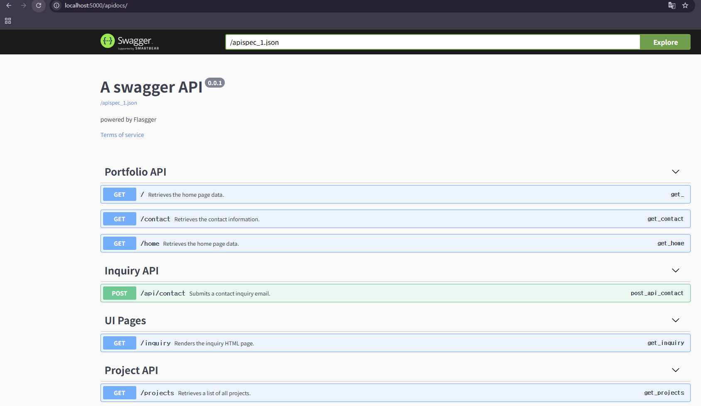
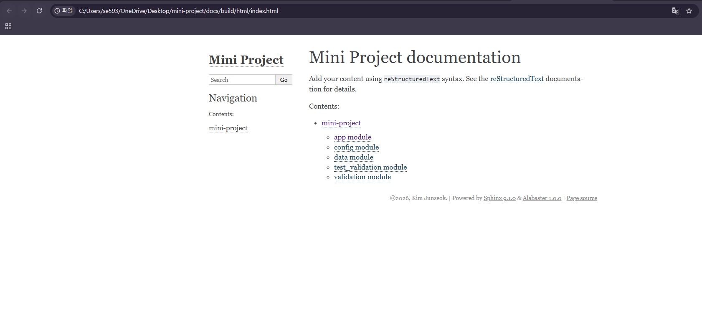

# 1. 📂 Junseok's Portfolio & GitHub Analyzer
### "개인 포트폴리오 서빙에서 시작하여, 개발자의 실무 역량을 정량화하는 깃허브 분석 엔진으로"
> **🔗 실시간 배포 문서:** [GitHub Pages 바로가기](https://oll01.github.io/mini-project/build/html/index.html)

---

# 2. 📸 Visual Demonstration
> **"프로젝트 구동 화면입니다."**

*▲ Swagger UI로 구현한 인터랙티브 API 테스트 환경 (Part 4)*

*▲ Sphinx를 통해 자동 생성된 공식 기술 문서 페이지 (Part 4)*

---

# 3. 🎯 Motivation & Problem
### "왜 이 프로젝트를 시작했는가?"
취업 준비를 하며 리크루터가 내 깃허브를 분석하는 시간이 **평균 1분도 안 된다**는 사실을 알게 되었습니다. 정적인 PDF 이력서만으로는 제가 가진 설계 역량을 충분히 보여주기 어렵다고 판단했습니다.

그래서 저라는 사람을 하나의 **API 서비스**로 만들었습니다. 지금은 제 정보를 제공하는 수준이지만, 앞으로는 **리크루터가 제 깃허브 활동(커밋 패턴, 코드 품질 등)을 한눈에 분석할 수 있는 'GitHub Analyzer'**로 확장할 계획입니다. 제가 어떤 엔지니어인지 데이터로 직접 증명하고 싶었기 때문입니다.

---

# 4. 🛠 Tech Stack & Rationale
### "기술 선택의 이유"
* **Python & Flask**: 데이터 처리와 API 서버 구축에 가장 효율적인 조합이라 선택했습니다.
* **Sphinx (Google Style)**: "코드가 곧 문서가 되어야 한다"는 생각으로 도입했습니다. 나중에 기능을 확장하더라도 문서가 꼬이지 않게 자동화했습니다.
* **Flasgger (OpenAPI)**: 제 포트폴리오를 확인하는 분들이 별도의 설치 없이 브라우저에서 바로 API를 써볼 수 있도록 '배려' 차원에서 넣었습니다.

---

# 5. ✨ Key Features
* **Personal Data API**: 인적사항, 프로젝트, 연락처를 JSON 데이터로 깔끔하게 쏴줍니다.
* **Interactive Sandbox**: Swagger UI 덕분에 클릭 몇 번으로 제 데이터를 테스트해 볼 수 있습니다.
* **Automated Docs**: 코드에 주석만 잘 달아두면 전문적인 기술 문서가 자동으로 생성됩니다.
* **Professional Standard**: 구글 스타일 주석 규격을 지켜서 누구나 읽기 편한 코드를 지향했습니다.

---

# 6. 🚀 Getting Started Guide
### "직접 실행해보고 싶다면?"
1. **저장소 가져오기**
   `git clone https://github.com/Oll01/mini-project.git`
2. **필요한 라이브러리 설치**
   `pip install -r requirements.txt`
3. **서버 켜기**
   `python app.py`
4. **결과물 링크**
   - 배포된 공식 문서: [GitHub Pages 링크](https://oll01.github.io/mini-project/build/html/index.html)
   - 로컬 테스트: http://localhost:5000/apidocs/

---

# 7. 🧠 Lessons Learned / Challenges
### "단순 코딩을 넘어 시스템 설계를 배우다"
이번 프로젝트를 진행하며 가장 크게 느낀 점은 **"아무리 좋은 코드도 설명되지 않으면 가치가 없다"**는 것입니다. 

처음엔 단순히 기능 구현(Part 1)만 생각했지만, 이를 문서화하고 배포하는 과정(Part 4)을 거치며 전체적인 개발 프로세스를 이해하게 되었습니다. 특히 Sphinx 배포 과정에서 경로 설정 에러를 해결하며 파이썬 시스템 구조를 깊게 공부할 수 있었습니다. 전자공학도로서 하드웨어 사양을 꼼꼼히 챙기듯, 소프트웨어에서도 문서화가 곧 '신뢰'라는 것을 배운 경험이었습니다.